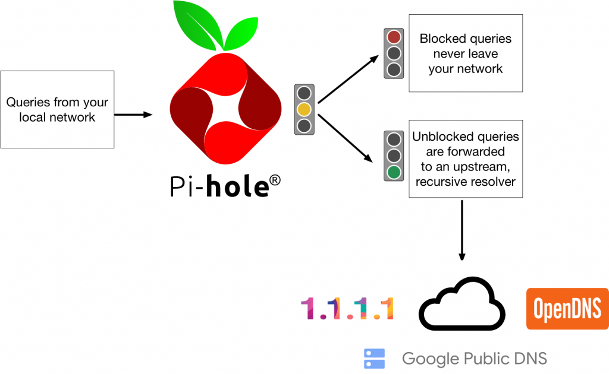
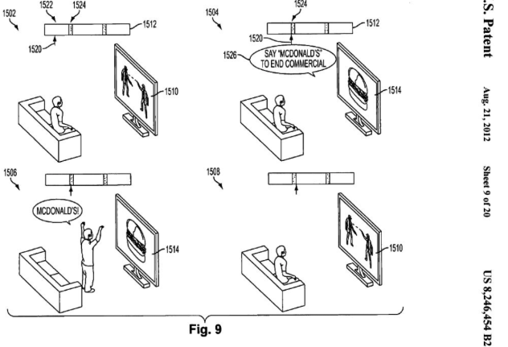

#!/bin/env slides

# Ads

By Bruce Hill
(RC Spring 1 '25)

---

# Ads Suck

Ads really, really suck.

Ads are some of the _ugliest_ and most aesthetically
displeasing things in our society.

You literally have to pay money to _force_ people to watch them.

---

# Consumerism

The purpose of advertising is to convince people who don't
want to buy your product that they should actually want to
buy it.

Advertising exists to manufacture dissatisfaction and desire.

A person who is content with their life is the worst
nightmare of an advertising professional.

---

# Discovering New Products

I have sometimes heard people say that ads aren't all bad
because they sometimes find out about products that they're
interested in buying that they might not have found otherwise.

This is the reasoning of someone coping with the fact that
they were tricked into spending money and rationalizing that
they are now _happier_ because of it.

---

# Deceit

Plato describes rhetoric as the skill of making the weaker
argument appear to be the stronger.

From this viewpoint, advertising is the distilled art of
rhetoric--making crappy products appear to be valuable and
desirable.

The argument of advertising comes down to this:

> You are unhappy and discontent,
> but if you buy our product, subscribe to our service,
> sign up for our credit card, use our platform,
> you will be content and happy.

---

# Ubiquity

Advertising has completely saturated our visual landscape,
the internet, our industry, our culture.

These are some places you can find ads:

- Covering every website you visit
- Plastered on every vertical surface in the city
- In the podcast or radio station you're listening to
- In your Windows start menu
- Being read aloud by your most trusted online personalities
- In every app on your phone
- Autoplaying videos in your face in a cab or airplane
- Above every legitimate search result on every platform
- In glowing displays on every street corner and on top of cars
- The lawn of the White House

---

# Perverse Incentives

If ads were _just_ annoying and misleading, I think the
situation would be tolerable.

However, I think ads are the root of many of the problems in
our industry and society. Specifically, I think these are
the worst-impacted areas:

- Capitalism
- Mass surveillance
- Platform incentives

---

# Capitalism

I don't want to dwell on this part too long, because I want
to focus on the other parts.

But, in brief: every advertisement is a piece of propaganda
in support of capitalism. Every ad sells the idea that a
capitalist economy can solve your problems if you buy the
right product.

- Afraid of corporate mass surveillance?
  _Free yourself with NordVPN!_
- Sick of living in a filter bubble in a world where print
  media has been destroyed by online platforms?
  _Get an unbiased picture of the world with Ground News!_
- Depressed about living in a capitalist dystopia?
  _Try an unlicensed gig worker therapist with Better Help!_

These are problems _created_ or _exacerbated_ by our
capitalist advertising economy, and they'll turn around and
sell you the cure for all that ails you.

---

# Advertising and Mass Surveillance

The ace up the sleeve of the modern advertising industry is
**targeted advertising**.

What this actually means is tracking every aspect of
people's behavior across their life and using it to build a
profile which can be sold or resold to advertisers.

The consequence of this is that we have built a mass
surveillance system that would make Big Brother salivate.
And it's a system that is completely free from oversight,
constitutional rights, and impossible to fully escape.

[Maciej Ceglowski](https://idlewords.com/talks/haunted_by_data.htm) has compared this to creating giant
warehouses full of radioactive waste: it's deeply sensitive
information that causes real-world harms when it leaks, so
we have to spend enormous amounts of time and energy to
storing it securely, and it's a problem that _we_ have created.

---

# Enshittification

Now, I want to talk a bit about what living in an ad economy
does to the internet.

Many, if not most, tech companies rely on ads as a primary
source of income. If your company relies on ads, it probably
follows this business model:

1. Initially, the company must grow at all costs. You can
   plow billions into the ground losing money on each
   customer until you have enough customers.
2. As you plow money into growth, you outcompete traditional
   sustainable business models because you charge "nothing"
   for a high quality product.
3. Once you have enough users, you can turn on the money
   spigot and start putting ads into every crevice of your
   product. Your competition has gone bankrupt or been
   bought out, the network effects are strong, and people
   can't leave.

Cory Doctorow has coined the term ["enshittification"](https://doctorow.medium.com/social-quitting-1ce85b67b456) for
this process, and it's a pattern that has been played out
over and over again.

---

# Engagement

Meanwhile, your product team is following these principles:

1. Gather as much data on your users as you can
2. Use that data to maximize "engagement", AKA amount of time
   the user's eyeballs are on your product.

In the logic of an advertising-based company, the most
important thing is not for your users to feel like they're
happy with your product, it's to make them spend _time_ with
your product.

This means that any engagement is good, even if the
engagement is:

- Infuriating
- Depressing
- Politically radicalizing
- Addictive

...because time and eyeballs sell ads.

---

# Fighting Back

There are a few things that can be done to push back against
the advertising dystopia we live in:

- Blocking ads
- Limiting ad tracking
- Refusing to build the systems

---

# Blocking Ads

If there's nothing else you take from this talk, take this:

**Use [uBlock Origin](https://ublockorigin.com/)!**

uBlock Origin is the _only_ adblocker you should be using on
any platform where it's available.

Many years ago, AdBlock Plus used to be a reputable ad
blocker, but they started taking bribe money to allow
through "acceptable ads", selling out their users to
advertisers. Most other ad blocking products are similar.

---

# Pi-Hole

A lower-level approach to ad blocking is [Pi-Hole](https://pi-hole.net/), which is a
computer (typically a Raspberry Pi) running as a DNS proxy
on your computer network.

You configure your WiFi router to act as a DNS server for
handling all network requests made on your home network.
When a device on your network makes a request to
`en.wikipedia.org`, the Raspberry Pi will forward that DNS
lookup to a real DNS server on the internet. But if the
request is to a known advertising domain like
`ads.doubleclick.net`, the Raspberry Pi will say, "ooh!
that's me! I'm `ads.doubleclick.net`!" and return its own IP
address. Then, it will return an empty response when your
device tries to load the ad.

This means that every device on your network gets ad
blocking for free! And it even works inside of proprietary
applications where it's impossible to install an ad blocker
(e.g. smart TVs, smart refrigerators, mobile apps)

It's not perfect, because it operates at the domain name
level, so it's still a good idea to run uBlock Origin in
parallel when you can.

---

# Pi-Hole Diagram

---

# Sponsor Block

Another great tool for blocking ads is a browser plugin
called Sponsor Block. It uses crowd-sourced tagging of
YouTube videos to mark the beginning and end of sponsored
segments embedded in the video and automatically skip past
them when you're watching it.

**Please support your favorite creators on Patreon or
whatever YouTube's version of that is called!** If there's a
world where people make amazing content as a career without
advertising, it has to be one where they're directly
financially supported by their fans. The actual ad revenue
per viewer is laughably small and the business model only
works when creators chase huge audiences. Let's support
niche creators with small, but passionate fanbases who can
chip in a few dollars directly!

But also please don't waste your time and brainpower on
watching or manually skipping past your favorite creators
debasing themselves doing ad reads for sketchy companies
that scam their customers.

---

# Call to Action

If you don't have an ad blocker installed, please install
uBlock Origin today!

And if you do have it installed already, then please help a
friend or family member install it on their device. It only
takes a few seconds, and people who are less technologically
capable might not even be aware of how much better the
internet is without ads.

---

# Limiting the Power of Ads

Another thing you can do is to limit the most invasive
technologies used to target ads. When ad targeting is less
accurate, ad revenue decreases and _you_ get to live a more
private life. Win-win!

This can be done in two ways:

- Legislatively
- Technologically

---

# Legislative Approaches

I really like the GDPR and California's CCPA.
They're _annoying_ for tech employees who work at
privacy-invading companies, and that's a good thing.
People _should_ have the right to request their data be
deleted and to know what data is being gathered about them!

NYC is another good example: in NYC there are _aggressive_
restrictions on public advertising. You're not allowed to
put billboards within several hundred feet of highways and
parks, plus other restrictions.

_Our cities don't have to look like this!_

---

# Technological Approaches

A rare success story from the tech industry comes from
Apple, whose revenue derives primarily from physical
device sales and platform taxes, _not ads_.

In April 2021, Apple massively disrupted the iOS advertising
industry by changing their technology to no longer make it
easy to track a persistent user identity across different
apps and websites. This made it _dramatically_ harder for
sketchy ad companies to cross-tabulate your behavior across
your entire digital life to sell you ads. Apple probably did
this to force people to buy ads through their first-party ad
network and crush their competitors, but I still think it's
a win.

---

# Refusing to Build the Systems

This is a room full of software engineers, most of whom will
soon be looking for a job in the tech industry.
Even though the Empire pays well, _you don't have to build
the Death Star_. You're a free agent!

I'd like to call on you to _not_ take interviews with
companies whose business models revolve around advertising.
Talk to jobs services and let them know you'd rather look at
companies that aren't in the ads business.

---

# Someone Has to Build It

---

# Someone Has to Build It

> The best minds of my generation are thinking about how to
> make people click ads. --Jeff Hammerbacher

We have wasted _so much_ of our generation's talent on
building mass surveillance consumerist crapware that has
undermined democracy and destabilized our society and
collective mental health. Let's not keep doing that!

I'd like to live in a world where the best minds of our
generation want to work on other things, and the only people
who can get hired in the advertising industry are overpaid
third-raters who lack a conscience!

---

# Thanks

Go block an ad today!
