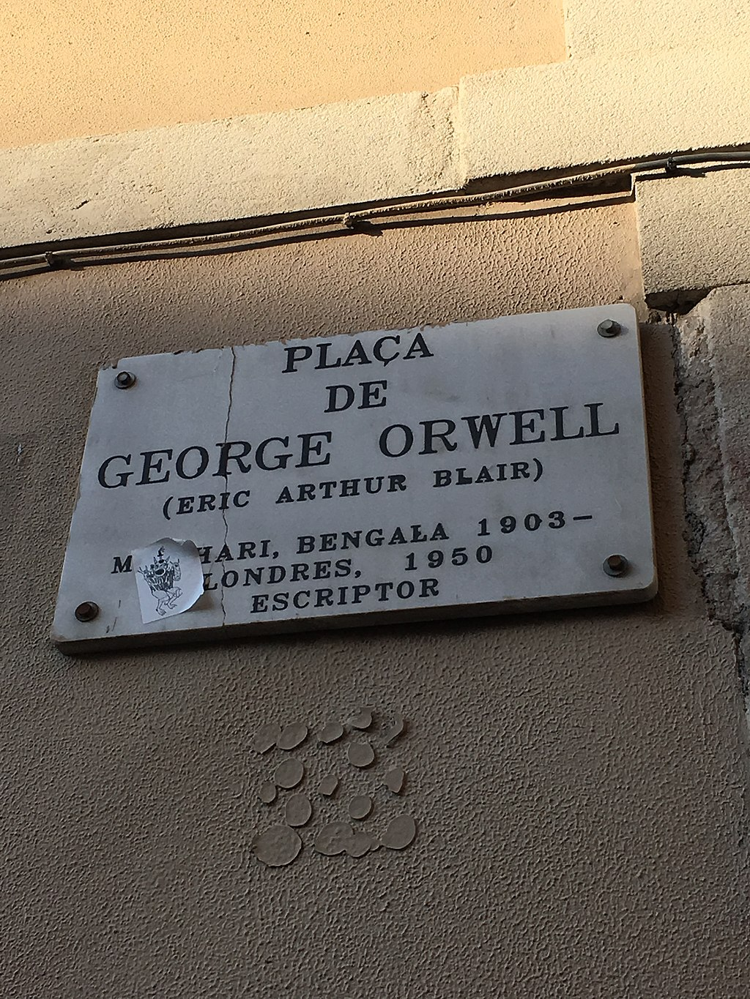
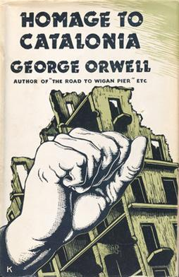

#!/bin/env slides

# George Orwell

_"More than just 1984 and Animal Farm!"_

By Bruce Hill

---

# Quick Bio

Born **Eric Arthur Blair** in 1903 in British India.

"Lower-upper-middle-class" family

Mother moved with him and his sisters to Oxfordshire,
England in 1904

Grew up miserable at school (["Such, Such Were the Joys"](https://orwell.ru/library/essays/joys/english/e_joys))
(Coincidentally, was later taught French by Aldous Huxley)

---

# Burma

After studying at Eton, Blair's family couldn't afford to
send him to university, so he joined the Indian Imperial
Police in Burma.

Really intensified his hatred of British Empire
See: [Shooting an Elephant](https://www.orwellfoundation.com/the-orwell-foundation/orwell/essays-and-other-works/shooting-an-elephant/)
and: [A Hanging](https://www.orwellfoundation.com/the-orwell-foundation/orwell/essays-and-other-works/a-hanging/)

Got knuckle tats:

> While in Burma, he acquired a moustache similar to those
  worn by officers of the British regiments stationed there.
  [He] also acquired some tattoos; on each knuckle he had a
  small untidy blue circle. Many Burmese living in rural
  areas still sport tattoos like this—they are believed to
  protect against bullets and snake bites.

(foreshadowing)

---

# Excerpt: A Hanging

From the essay [A Hanging](https://www.orwellfoundation.com/the-orwell-foundation/orwell/essays-and-other-works/a-hanging/)

> It was about forty yards to the gallows. I watched the
  bare brown back of the prisoner marching in front of me.
  [...] And once, in spite of the men who gripped him by
  each shoulder, he stepped slightly aside to avoid a puddle
  on the path.

> It is curious, but till that moment I had never realized
  what it means to destroy a healthy, conscious man. When I
  saw the prisoner step aside to avoid the puddle, I saw the
  mystery, the unspeakable wrongness, of cutting a life short
  when it is in full tide. This man was not dying, he was
  alive just as we were alive. All the organs of his body were
  working –bowels digesting food, skin renewing itself, nails
  growing, tissues forming–all toiling away in solemn foolery.
  His nails would still be growing when he stood on the drop,
  when he was falling through the air with a tenth of a second
  to live. His eyes saw the yellow gravel and the grey walls,
  and his brain still remembered, foresaw, reasoned – reasoned
  even about puddles. He and we were a party of men walking
  together, seeing, hearing, feeling, understanding the same
  world; and in two minutes, with a sudden snap, one of us
  would be gone – one mind less, one world less.

---

# Down and Out

In Burma, he contracted Dengue Fever and went back to
England on medical leave, where he decided to quit the
police force.

Spent a period of time exploring the poor parts of London
and later, Paris. Initially, disguising himself as a tramp,
but later, genuinely destitute and living on the edge of
starvation. Went by "PS Burton".

First published essay, ["The Spike"](https://orwell.ru/library/articles/spike/english/e_spike) about
"tramp houses" also called "spikes" for homeless people.

Did odd jobs as a journalist writing pieces for various
left-leaning publications about the conditions of the poor
and the social systems that led to them.

First novel based on his time in this period:
[Down and Out in Paris and London](https://en.wikipedia.org/wiki/Down_and_Out_in_Paris_and_London)

---

# Back to England

After getting sick (again) and returning to England (again),
Blair did some time as a teacher.

[A Clergyman's Daughter](https://en.wikipedia.org/wiki/A_Clergyman%27s_Daughter) is based on this period of his life.

Later, worked in a used bookstore, which was the basis for
[Keep the Aspidistra Flying](https://en.wikipedia.org/wiki/Keep_the_Aspidistra_Flying)
in which, the protagonist declares a personal war on money
and vows to never get a good job, but finds that being poor
means spending more time thinking about money than being rich.

---

# The Pseudonym

Started publishing essays and articles under a pseudonym to
prevent embarrassment to his family over his behavior.

Chose "George Orwell" because "It is a good round English name."

I think there was sort of a Batman/Bruce Wayne dynamic,
where "Eric Blair" was more of a facade than "George Orwell."
Blair was trapped in British respectability politics, but
Orwell was free to more honestly express his political opinions.

---

# Wigan Pier

After this, Orwell spent time researching the living and
working conditions of coal miners in Northern England.

Resulted in [The Road to Wigan Pier](https://en.wikipedia.org/wiki/The_Road_to_Wigan_Pier) (1937)

A very dry first half about documenting the horrible
conditions of coal miners, followed by a very spicy second
half about why we need socialism to prevent such things, and
why socialists are so bad at getting that idea across.

> It would help enormously, for instance, if the smell of
  crankishness which still clings to the Socialist movement
  could be dispelled. If only the sandals and the
  pistachio-coloured shirts could be put in a pile and
  burnt, and every vegetarian, teetotaller, and creeping
  Jesus sent home to Welwyn Garden City to do his yoga
  exercises quietly! But that, I am afraid, is not going to
  happen.

_Very unpopular with his socialist publishers._

---

# Socialism

I think a lot of people get the wrong idea from his later
criticisms of Stalinism that he was some kind of reactionary
right-winger (he's often embraced by the American political
right today), but he was really an ardent atheist socialist
who was opposed to totalitarian regimes.

> Every line of serious work that I have written since 1936
  has been written, directly or indirectly, against
  totalitarianism and for democratic socialism, as I
  understand it.

---

# Spanish Civil War

After Wigan Pier, Orwell got married and then immediately
left to go fight in the Spanish Civil War (lol).

Rough breakdown:
1. The **Spanish Republic**, the legitimate democratic government
2. **Francisco Franco**, fascist coup
3. Pro-republic socialist **Workers' Party of Marxist Unification** (POUM)
4. Pro-republic communist **Unified Socialist Party of Catalonia**
   (backed by the USSR)
5. Pro-republic anarchist **Confederación Nacional de Trabajo** (CNT)

Orwell enlisted with the anarchists.

Absolute shitshow on all fronts.

---

# Orwell Plaza

Survived a battle in the heart of Barcelona.

(I've been, it's cool!)

---

# Uh Oh

Later, shot in the neck by a sniper.

Seems like the knuckle tats failed.

...but got super lucky and the bullet missed all the
arteries and left a clean wound.

Political infighting on the left led to total chaos on the
pro-republican side of the war.

The USSR-backed Spanish communist party started hunting down
dissidents, including Orwell's POUM as allegedly Trotskyist.

Orwell escaped Spain and was tried in absentia as a Trotskyist.

---

# Oops, All Fascists

It turns out that it's a very, very bad idea to prioritize
political purges _while you're fighting a civil war_.

Francisco Franco wins the civil war.

Spain has to endure Franco's fascist dictatorship until **1975!!!**

This is a guy who took power at the same time as Hitler and
ruled until bell bottoms went out of fashion for the second time.

---

# Homage to Catalonia

Orwell wrote an autobiographical novel about his experiences
in the Spanish Civil War: [Homage to Catalonia](https://en.wikipedia.org/wiki/Homage_to_Catalonia)

---

# WWII

During WWII, Orwell really, really wanted to fight against
fascism again, but was medically unfit (the guy low-rolled
on his VIT stat).

Suffering from Tuberculosis and Bronchitis.

Joined the British "Home Guard", a civilian militia.

Spent a lot of time writing pro-socialist and anti-Stalinist
essays and articles:

> One could not have a better example of the moral and
  emotional shallowness of our time, than the fact that we are
  now all more or less pro Stalin. This disgusting murderer is
  temporarily on our side, and so the purges, etc., are
  suddenly forgotten.

Had a brief stint as a radio presenter (no recordings survive).

---

# Essays

I think it's almost more accurate to think of Orwell as a
journalist and essayist than a novelist.

He wrote a _huge_ volume of essays throughout his life.

Some of my personal favorites are:

---

# Politics and the English Language

["Politics and the English Language"](https://www.orwellfoundation.com/the-orwell-foundation/orwell/essays-and-other-works/politics-and-the-english-language/)

> The great enemy of clear language is insincerity. When
  there is a gap between one's real and one's declared
  aims, one turns as it were instinctively to long words
  and exhausted idioms, like a cuttlefish spurting out ink.

---

# Can Socialists Be Happy?

["Can Socialists Be Happy?"](https://orwell.ru/library/articles/socialists/english/e_fun)

> Nearly all creators of Utopia have resembled the man who
  has toothache, and therefore thinks happiness consists in
  not having toothache.

---

# Charles Dickens
["Charles Dickens"](https://orwell.ru/library/reviews/dickens/english/e_chd)

> I have been discussing Dickens simply in terms of his
  ‘message’, and almost ignoring his literary qualities. But
  every writer, especially every novelist, has a ‘message’,
  whether he admits it or not, and the minutest details of
  his work are influenced by it. All art is propaganda.
  [...] On the other hand, not all propaganda is art.

---

# Why I Write

["Why I Write"](https://www.orwellfoundation.com/the-orwell-foundation/orwell/essays-and-other-works/why-i-write/)

> Every line of serious work that I have written since 1936
  has been written, directly or indirectly, against
  totalitarianism and for democratic socialism, as I
  understand it. It seems to me nonsense, in a period like our
  own, to think that one can avoid writing of such subjects.
  Everyone writes of them in one guise or another. It is
  simply a question of which side one takes and what approach
  one follows. And the more one is conscious of one’s
  political bias, the more chance one has of acting
  politically without sacrificing one’s aesthetic and
  intellectual integrity.

---

# The Other Stuff

Oh, I guess he also wrote a book called "1984" and one
called "Animal Farm" near the end of his life.

They're really good I guess, but everyone was forced to read
them in high school.

He died of tuberculosis shortly after finishing 1984 and
shortly before the invention of antibiotics that are
effective against tuberculosis.

---

# The End

Go read an Orwell novel or essay today!
