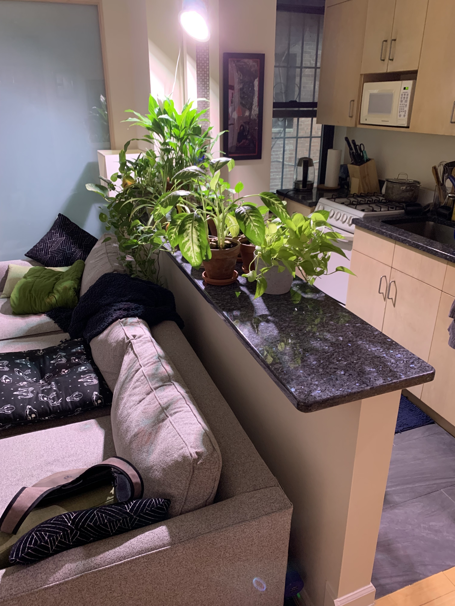

#!/bin/env slides

# Houseplants

And how to keep them alive for 12 years.

_by Bruce Hill_

-----------------------------------------

-----------------------------------------

# My Houseplants

I have a bunch spread across the apartment.
This talk will walk you through some basics.

-----------------------------------------

# Buy a Plant

- Go to Home Depot (good prices)
- Trendy plant shops are overpriced (but have cute pots)
- Read the labels on the plants for light conditions
- Nice to have: a small watering can (~$2)

-----------------------------------------

# Easy Plants: Peace Lily

- I've had mine for 12 years (!)
- Low light
- Very emotive
- Pretty flowers sometimes

-----------------------------------------

# Side Note: Hot Fuzz

> Yes, I’ve been tending my Peace Lily for three
> years now. NASA rates it as one of top ten air
> cleaning plants. It oxygenates the room, it
> helps me think, it relieves stress. Its needs
> are simple.

-----------------------------------------

# Easy Plants: Snake Plant

- Low light
- Needs good drainage
- Tolerates infrequent/inconsistent watering
- AKA "mother-in-law's tongue" lol
- Can propagate with clippings

-----------------------------------------

# Easy Plants: Pothos

- Jungle plant
- Low light
- Dangly (nice for putting on a bookshelf)
- Tolerates overwatering well (rainforest mutation)
- Easy to propagate

-----------------------------------------

# Easy Plants: Succulents

- High light
- Need good drainage
- California vibes
- Lots of variety
- Weird alien plants

-----------------------------------------

# Drainage

Most plants' roots will rot if left to sit in water.
(Pothos and other rainforest plants are an exception)

Ideally, you want damp soil, not standing water.

Pots have drainage to solve this problem:

- Little hole at the bottom to let excess water out
- Catchment tray to catch the water
- Unglazed clay pots are porous

Plant pots are not buckets of dirt!

You can put pots with drainage inside decorative pots,
but don't forget to empty the water if it's coming out
the bottom!

-----------------------------------------

# Watering Basics

1. Poke your finger in the soil.
2. If it's cold (wet), don't water. Damp soil is also darker.
3. Slowly pour water on top of the soil.
4. Wait a bit for it to settle (you can hear it)
5. Be ready to dump out catchment tray if you poured too much.
6. Ideal amount of water is a tiny bit coming out the bottom, or just shy.

-----------------------------------------

# Watering Tips

- Very dry soil absorbs water **slower** than damp soil. For
  very dry plants, pour a little bit, wait, pour a bit more.
- When water drains out the bottom, it clears out accumulated
  waste in the soil. Do this at least every once in a while.
- For sensitive plants, leave water to sit for a few hours
  before watering so chlorine in the tap water evaporates.
- Add a bit of fertilizer to the water every so often to
  provide essential nutrients.

-----------------------------------------

# (Re)potting

Sometimes you want to move a plant to a new pot
(e.g. if it's getting too big)

- Go to a farmer's market and buy nice soil (Union Square)
- Choose high/low drainage soil appropriately
- Put plant in its old pot in the sink when dry
- Dig your hands in and lift the plant out from the roots
- Untangle the roots if they're too clumped up
- Fill new pot with a bit of soil
- Move plant into new pot and start packing in soil
- Firmly tamp down the soil until it is a bit below the
  rim of the pot.
- Water the plant and be prepared to add more soil as it settles

-----------------------------------------

# Grow Lights

- Good for dark apartments
- Get them at a hardware store
  - Grow bulb (~$10)
  - Clamp lamp fixture (~$15)
  - Timer (~$7)
- Hook up to a timer
- Plants are happy 😊
- **Bonus:** wake up to artificial sunlight

-----------------------------------------

# Propagating

- Plants want to grow and reproduce.
- **Big Plant** wants to charge you money and keep you dependent.
- Propagating lets you make more plants for free.
- Different for each plant species.
- Not that hard!

1. Take clippings or sprouts
2. Put in a cup or tray or bottle until they develop roots.
3. Plant in soil.
4. Profit!

-----------------------------------------

# Go Forth and Propagate!
