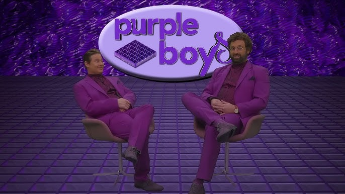
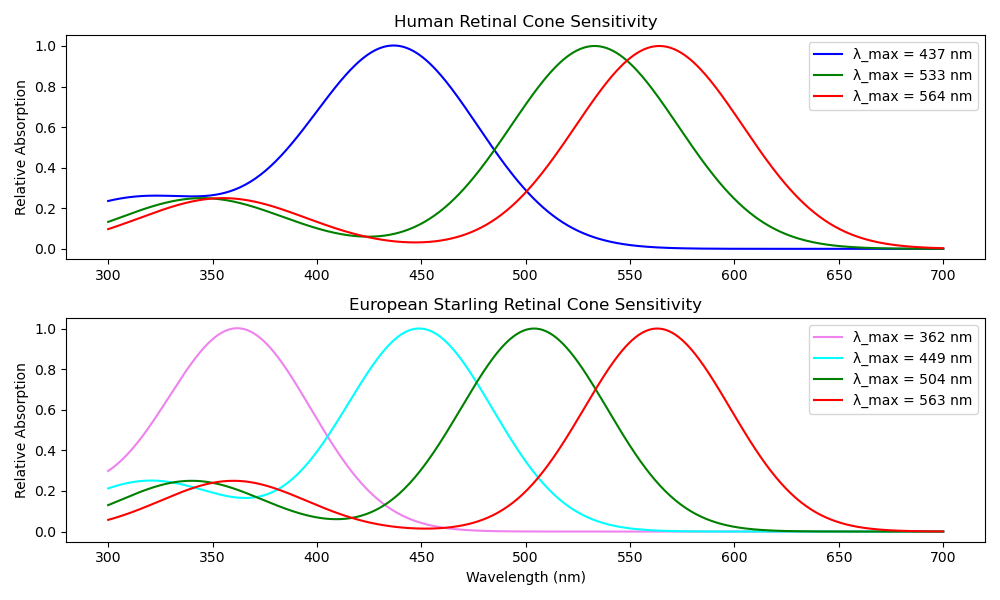

#!/bin/env slides

# Purple - what is it?



```demo
sxiv -sf purple-boys.jpg
```

---

# Retinal Cones

Purple is a mix of red and blue light.



```demo
sxiv -sf retinal_cones.png
```

Our eyes see it as violet.

---

```demo
printf '\033[2J'
python3 purple.py
read -p "Press enter to continue"
```
