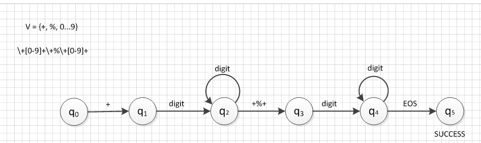
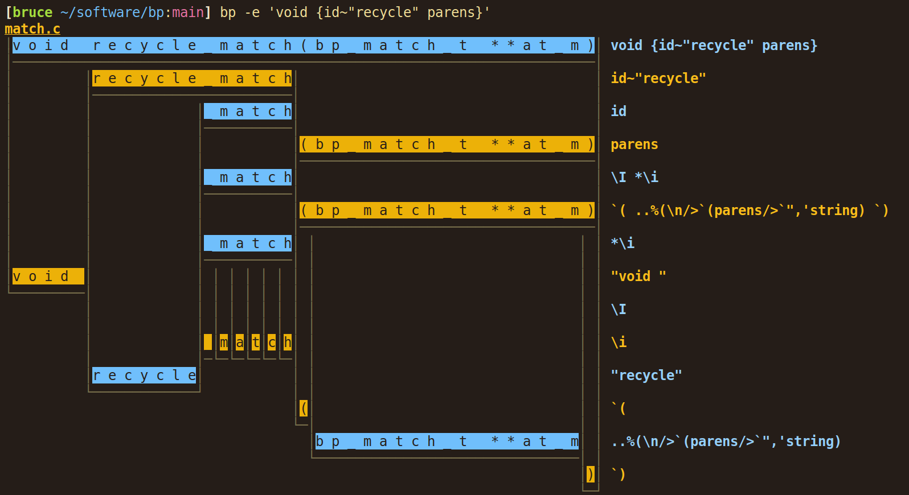

#!/bin/env slides
# Beyond Regex

_Bruce Hill_

---

# 99 Problems

I have grown to strongly dislike regex.

This talk is going to be about moving beyond regex.

([Obligatory XKCD link](https://xkcd.com/1171/))

---

# Problem: Computer Science

Regex are capable of matching **regular** grammars.

Typical grammars used in programming are _not regular_.

Computer scientists suck at naming things.

TL;DR: regex are implemented using a finite state machine:



Finite state machines are efficient to implement, but by
definition, they're **finite**, which means they can't match
**arbitrarily** nested data.

---

# Problem: Nested Data

What do I mean by "can't match arbitrarily nested data"?

It means regex can't match a ton of stuff you care about:

- Function calls (nested parens)
- JSON objects (nested curly braces)
- `if` statements (nested `if` statements)
- (Lisp (nested (parens)))
- HTML (nested tags)

---

# Problem: Performance

Okay, but regex are _efficient_, right? No.

Regex are very fast for some use cases, but can experience
exponential performance degradation because of catastrophic
backtracking.

A simple regex like `(x+x+)+y` can take [ages](https://blog.codinghorror.com/regex-performance/) to check a
string like `xxxxxxxxxxxxxxxxxxxxxxxxx` for a match,
because regex requires retrying each submatch.

---

# Problem: Complexity

Okay, but regex are _simple_, right? No.

PCRE library:

```
********************************************
Language      files   blank  comment    code
********************************************
Text             20    5270        0   85088
C                55   13878    13050   66164
HTML            101     249        6   22386
Bourne Shell      8     576      434    2527
m4                5     292       28    1775
DOS Batch         2     302       43    1375
CMake             7     216      259    1265
YAML             10     236      140    1173
Python            8     392      682     885
make              1     127       95     808
Markdown          4     144        0     477
Perl              5      96       78     441
Bash              1      46       47     244
Starlark          2      12       20     153
Zig               1      32        4     147
PowerShell        2      21        4      66
********************************************
SUM:            232   21889    14890  184974
********************************************
```

---

# Comparison: Lua

Lua's entire source code (for a whole programming language!)
is less than 1/3rd the size of PCRE:

```
*******************************************
Language     files  blank  comment     code
*******************************************
C               61   4643     5379    20076
make             1     47       12      166
C/C++ Header     1      1        3        5
*******************************************
SUM:            63   4691     5394    20247
*******************************************
```

---

# Lua's Patterns

> Unlike several other scripting languages, Lua does not use
> POSIX regular expressions (regexp) for pattern matching. The
> main reason for this is size: A typical implementation of
> POSIX regexp takes more than 4,000 lines of code. This is
> bigger than all Lua standard libraries together. In
> comparison, the implementation of pattern matching in Lua
> has less than 500 lines. Of course, the pattern matching in
> Lua cannot do all that a full POSIX implementation does.
> Nevertheless, pattern matching in Lua is a powerful tool and
> includes some features that are difficult to match with
> standard POSIX implementations. 

---

# Lua's Patterns

Lua has a drastically simplified form of pattern matching:

- Character classes, e.g. `%d` for digits
- Optional/repetition with `?`, `*`, `-`, and `+`
- Pattern captures with `()`

But it can also do one thing that regex can't do:

- **Balanced groups** with `%b()`, `%b{}`, etc.

Not as full-featured as regex, but useful enough for many
common applications (used in some OpenBSD projects as an
alternative to regex).

---

# Problem: Leaning Toothpick Syndrome

One other major problem with regex is **leaning toothpick
syndrome**, where you need to escape all kinds of common
characters.

Regex has **way too many** special characters:

`.{}[]()^$?+-|\`

If you're trying to do pattern matching on _code_ using
regex inside a string literal, you end up with code that
looks like:

```bash
sed "s/^ftp:\/\/[^\/]*\/pub\/\$/foo/"
```

---

# Regex Alternatives

As previously mentioned, Lua has a built-in pattern matching
syntax that is similar to regex, but simpler and more
efficient (no backtracking) with balanced parenthesis
matching.

Lua also has the excellent [LPEG](https://www.inf.puc-rio.br/~roberto/lpeg/) library,
with regex-style syntax in the [re module](https://www.inf.puc-rio.br/~roberto/lpeg/re.html).
These use Parsing Expression Grammars (PEGs), which are
dramatically more expressive than regex and can match
arbitrarily nested grammars.

However, I'd like to shill some of my own alternatives...

---

# What Do You Want?

I've made some regex alternatives that I approached from
first principles, thinking about things you'd want in a
pattern-matching DSL meant to be used either inside a
programming language (as a library) or as a command-line
tool:

- Matching exact strings should be as simple as possible
- Must be able to match basic nested structures like
  nested parentheses
- Syntax must be as concise as possible, while still being
  readable.
- Must play nicely with string literals
- Minimal need for escaping

---

# Project 1: BP

I while ago, I took a stab at creating a `grep` alternative
that uses PEGs for matching instead of regex. The result is
[BP - Bruce's PEG tool](https://github.com/bruce-hill/bp).

BP's grammar is similar to LPEG's `re` grammar and should
look somewhat familiar to people who have used regex or PEGs
before. However, there are two major differences:

1. All text is treated as literal text, except inside curly
   braces, so `foo.baz({int})` will match the exact literal
   string `"foo.bax("` followed by the pattern `int`,
   followed by the exact literal string `")"`.
2. Modifiers like `*` are _prefix_ instead of _postfix_. In
   my opinion, this makes the patterns easier to write,
   read, and parse.

---

# BP Example

What does this look like in practice? BP is a command-line
tool similar to `grep`, so it can be used like this:

```bash
bp -I 'if{_ @parens __ @braces}' -r 'if @1 @2'
```

In this example, I am in-place replacing all `if(...){...}`
conditions with with a consistent style using a capture
(`@`) and the recursive rules `parens` and `braces`. So, for
example, this code will be replaced like so:

```c
if(x < foo())
{
    while (condition()) {
        doop();
    }
}
// Into:
if (x < foo()) {
    while (condition()) {
        doop();
    }
}
```

---

# Visualizing Matches

BP also comes with a tool to visualize matches:



---

# How Does It Stack Up?

```
******************************************
Language      files  blank  comment   code
******************************************
C                14    328      456   3321
Markdown          5    160        0    541
make              2     29       30    101
Lua               2     16        2     54
Bourne Shell     30      2       60     51
******************************************
SUM:             53    535      548   4068
******************************************
```

Performance-wise, `bp` is _very_ competitive with `grep`
...for patterns that start with a string literal.
I cheat and just use `strstr()` on a memory-mapped file,
and proceed with matching from there.

...but that turns out to be the _vast_ majority of
real-world cases. In other cases, it's fast enough to do
manipulations on tens of thousands of lines of code. It's
written in performance-conscious C code, but without a lot
of time spent on algorithmic optimizations.

---

# Alternative 2: Tomo Patterns

BP was a fun and useful project (I use it daily), but I
wanted something even simpler for the standard library of my
programming language **Tomo**.

Tomo uses an efficient tree datastructure to represent text
(for fast concatenation), so I couldn't use `bp` without
significant modifications, since it was written to operate
on C strings.

Thus: Tomo's Patterns

Tomo's pattern language has a few nice features:

- Built-in rules for matching URLs, emails, IP addresses,
  and other common patterns that are hard to get right.
- Full unicode support, including matching unicode
  attributes like "emojis"
- Concise expression of nested group matching: `foo(?)`
- Easy matching of literal text
- Simple syntax for non-greedy wildcard matches: `if {..} then`

---

# Conclusion

In summary, I think we as programmers can do better than
regex, and I encourage you to look into alternatives the
next time you're trying to do some pattern matching.

If you want to parse something with structure, look for a
parsing expression grammar tool. If you want to parse
something simpler, consider a simpler tool like Lua's
pattern matching.

...or try BP and Tomo!
