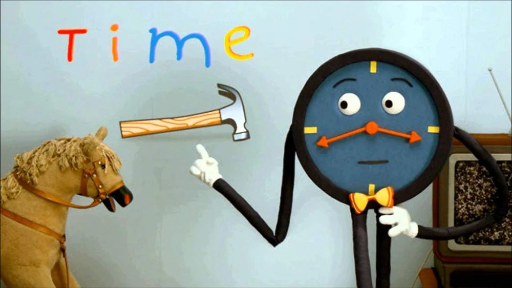
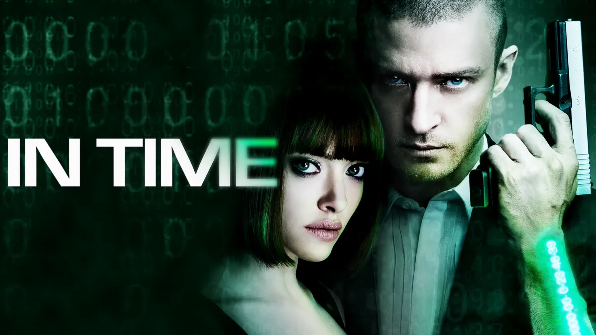

#!/bin/env slides

# Time

I'm Bruce and this is a talk about time.

--------------------------------

# Time Is a Social Construct

I'm gonna be talking about years and hours and
minutes and days and stuff.

Turns out time is pretty weird, and not a
real thing that exists in the universe.

Mostly this is just gonna be a bunch of
fun facts about the history of time.

---------------------------------

# In the Beginning

Since the dawn of time, time was dawn.

People used day/night cycles and seasonal
variations to keep track of the passage of time.

---------------------------------

# Hours

In ancient Egypt, they thought the constellation
**Sirius** was cool because it could be used to
predict the flooding of the Nile (very important).

Sirius has **12 stars**, so the Egyptians thought
it was a cool timey number and divided the night
into 12 intervals.

Everyone else in the wider region copied them
(Babylonians, Greeks, Romans, etc.)

---------------------------------

# Unequal Hours

Originally, there were 12 hours of daytime
and 12 hours of nighttime.

If you lived near the equator, this works pretty well.

If you don't, it means that a winter daytime
hour is shorter than a summer daytime hour.

Where I grew up (Seattle), this means that
an hour would be:

- **42 minutes** long on December 21 during the day
- **80 minutes** long on June 21 during the day

---------------------------------

# Unequal Hours

## Downsides

- The same thing takes a different number of hours
  in different seasons.
- Need to think about what season it is.

## Upsides

- Easy to measure with a sundial.
- Kinda useful to talk about fractions of
  available daylight time.
- No one wants to do anything during winter,
  so the hours are correspondingly wimpy.
- Very human.

---------------------------------

# Minutes and Seconds

- Invented in the Islamic golden age
- First **minute** division of an hour
- **Second** minute division of an hour
- 60 is a cool number (thanks Sumerians)
  - Is divisible by 2, 3, 4, 5, 6, 10, 12, 15, 20, 30

---------------------------------

# Calendars Are Hard

People historically kept track of the seasons using
an awkward combination of lunar cycles and solar
cycles, which was complicated and kept drifting out
of sync (not an even number of moon cycles in a year).

- **Julius Caesar** was a **pontifex**
  - Good for electoral shenanigans
  - But had to perform a religious ceremony to adjust the calendar
  - Too busy doing imperialism to bother adjusting the calendar
  - Got way out of sync
  - Invented the **Julian Calendar** to get out of the job
    - Solar calendar, so no drift
- Later **Pope Gregory** adjusted the calendar
  - The "**Gregorian Calendar**"

---------------------------------

# Weeks

- 7 days because, uh, 7 celestial bodies I guess?
  - Sun, moon, 5 other planets
- Days of the week named for the celestial bodies:
  - Saturn day
  - Sun day
  - Moon day
- Then the Norse got involved somehow
  - Tyr's day
  - Wotan's day (Odin)
  - Thor's day
  - Frigg's day (gotta get down on Frigg's day)

---------------------------------

# Astronomy Sucks as a Clock

Very sloppy, filing a bug report now:

- Can't tell time when it's cloudy
- Daylight hours change seasonally
- Latitude and longitude
  - Earth wobbles, so latitude and longitude are also bullshit
  - Continental drift
- Not an integer number of lunar cycles in a year
- Not an integer number of days in a year
- 365.2422 is a lame number (not easily divisible)
- Drifts over time because we live in a fallen world

---------------------------------

# We Can Make Better Clocks

I mean, not at first. Old clocks sucked.

- Water clocks
  - Dripping in a bucket at constant-ish time
- Candle clocks
  - Put nails in the side of the candle to loudly fall out

---------------------------------

# Imperialism and Capitalism

Two of the main driving forces for making better clocks
were imperialism and capitalism (name a more iconic duo)

## Imperialism

- How do we keep time across a world-spanning empire?
- How do you know how far you are across the ocean
  with no landmarks?

## Capitalism

- How do you make workers show up on time?
- How do you make workers work longer?
- How do you keep a train schedule between cities?

---------------------------------

# Time Zones

Once trains got fast enough, you'd actually notice
time differences between cities.

Every city ran on **local solar time.**

Railroads hated it, so they pushed for the adoption
of hour-bracketed **time zones.**

Synced up with **Greenwich Observatory** as the standard time.

---------------------------------

# Time Balls

Greenwich Observatory had a **time ball** that they dropped
at exactly 1pm.

Ships saw it drop and set their clocks accordingly.

Some random guy saw one and thought it would be a cool party
event for the NYT opening a new HQ in Times Square in 1905.

---------------------------------

# Clocks and Watches

Invented for navigation and religious purposes,
repurposed for industrial factories.

Previously people came in to work when the sun
came up, left when the sun went down.

Factory owners introduced clocks to remove all
slack from their workers' lives.

Major labor clashes over workers being fired
for not arriving at exactly the right time,
but also factory owners cheating the clock.

Workers forbidden from having their own watches.

---------------------------------

# What Is Time?

Once clocks started getting accurate, it raised
the question: "what is a second?"

**Not:** 1/(12 * 60 * 60)th of a day

Earth's rotation changes (tidal deceleration).

The French standardized the definition of a second:

- Originally based on an **average** day length
- Then based on the year length of 1900 (?!) "ephemeris second"
- Then bombarding ammonia with radiation till it radiates
- Then caesium radiation frequency (atomic clocks)
- In 2022, redefined to use optical clocks

---------------------------------

# Problems for the Future

Oh god, there's relativity too.

- Synchronizing time across planets is hard
- Time is subjective
- Time dilation
  - Your time is not my time.
- Relativity of simultaneity
  - What even is "now"?

I give up.

---------------------------------

# Time's Up

Okay I'm done.
