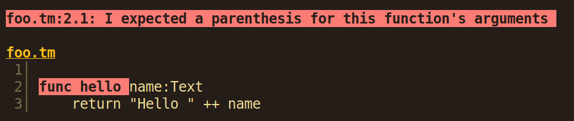
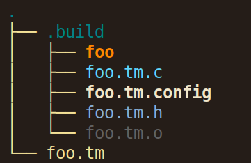
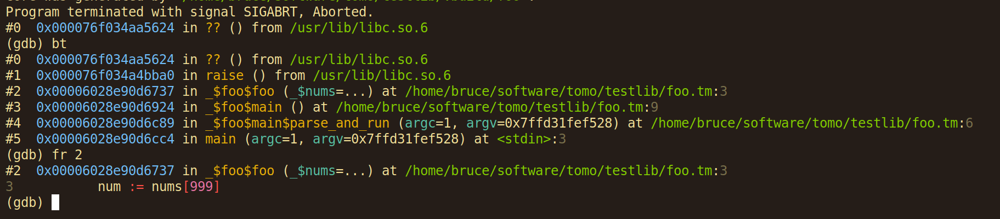

# Quick Summary

Tomo is the programming language I've been working on:

- Statically typed
- Imperative
- Cross-compiles to C
- Focus on safety, simplicity, speed

This talk is going to be about how Tomo got made and how you can make your own
languages.

---

# Tomo Compiler Overview

```
      76 text files.
      76 unique files.
      34 files ignored.

*******************************************************************************
Language                     files          blank        comment           code
*******************************************************************************
C                               73           2373            807          20002
Markdown                         2              7              0             40
Text                             1              3              0             21
*******************************************************************************
SUM:                            76           2383            807          20063
*******************************************************************************
```

---

# Ideation

When making a language, my first step is to write pseudocode:

```
hello = func(Text name)->Text {
    return "Hello {name}"
}

say(hello("world"))
```
(For example)

This language exists only in my brain and can't be parsed (let alone executed)
by a computer yet.

---

# Iteration

Working with pseudocode lets you iterate on language design _really fast!_

It costs you almost nothing to explore how different variations feel to type
and read:

```
Text hello(Text name) {
    return "Hello " ++ name
}
```

```
hello := (name Text) -> Text:
    return "Hello " ++ name
```

```
func hello(name: Text -> Text)
    return "Hello " ++ name
```

---

# Proof of Concept

For most language ideas, you're not trying to do something radically different
from any pre-existing language.

If there's a pre-existing language with similar semantics, it can be fairly
easy to translate your language's syntax into your target language's syntax.

For example, if we picked C, the examples would look like this:

```c
const char *hello(const char *name) {
    return asprintf("%s%s", "Hello ", name);
}
```

If we picked Python, it would look like:

```python
def hello(name:str)->str:
    return "Hello " + str(name)
```

It should be pretty obvious how you could perform this kind of translation
_manually_.

---

# Parsing

At this point, it's a good idea to pick a language and parsing technology that
you're comfortable with, and begin implementing a parser for a very limited
subset of the language.

I personally really like the Lua parsing library [LPEG](https://www.inf.puc-rio.br/~roberto/lpeg/).

I also like writing parsers in C.

Racket also has some good parsing tools.

**DO NOT ATTEMPT TO PARSE YOUR LANGUAGE WITH REGEX**

It is _impossible_ to parse most programming languages with regex, and it's a
waste of time to try. Learn a better tool and you'll thank me for it later.

---

# Fancy Parsing Tools

One approach to take is using parser generators or other tools that let you
write a grammar file.

You might write a grammar that looks like this:

```
file <- (__ statement)* __

statement <- functiondef / return / functioncall

functiondef <- "func" _ name _ "(" arg_signatures _ "->" _ type ")"
  __ "return" _ expression

arg_signatures <- (arg_signature (_ "," _ arg_signature)*)?
arg_signature <- name _ ":" _ type

type <- name

expression <- name / expr _ "+" _ expr / string

string <- '"' [^"]* '"'

name <- [a-zA-Z_][a-zA-Z_0-9]*

_ <- [ \t]*
__ <- [ \t\r\n]*
```

Most of these tools are built with the expectation that you don't care about
whitespace... but I usually _do_ care.

---

# Handwriting a Parser

The approach I like using in C is inspired by the approach used in the Lua
parser.

Use a variable for the current position in the text being parsed, and use two
types of functions: low-level functions that match exact strings or simple
string patterns, and high-level functions that match abstract syntax trees:

```c
void spaces(const char **pos) {
    while (isspace(**pos))
        *pos += 1;
}

bool match_str(const char **pos, const char *target) {
    if (strncmp(*pos, target, strlen(target)) != 0)
        return false;
    // Advance the position:
    *pos += strlen(target);
    return true;
}

ast_t *match_var(const char **pos) {
    if (!isalpha(**pos) && **pos != '_')
        return NULL;

    size_t len = 1;
    while (isalpha((*pos)[len]) || (*pos)[len] == '_' || isdigit((*pos)[len]))
        len += 1;

    const char *name = strndup(**pos, len);
    *pos += len;
    return NewAST(Var, .name=name);
}
```

---

# Setting Expectations

A common pattern is mandatory patterns. Cases where if something isn't present,
it's a syntax error.

```c
ast_t *expect(const char **pos, match_fn_t matcher, const char *msg) {
    ast_t *match = matcher(pos);
    if (!match) errx(1, msg);
    return match;
}

void expect_str(const char **pos, const char *str, const char *msg) {
    if (!match_str(pos, str)) errx(1, msg);
}
```

This lets us use shorthand like:

```c
ast_t *var = expect(pos, match_var, "Oh no, I was expecting a var here");
```

---

# More Advanced Example

```c
ast_t *match_func_def(const char **pos) {
    if (!match_word(pos, "func"))
        return NULL;

    spaces(pos);
    ast_t *name = expect(pos, match_var, "No function name provided!");
    spaces(pos);
    expect_str(pos, "(", "I expected a parenthesis!");
    ast_list_t args = {};
    while (1) {
        spaces(pos);
        ast_t *arg = match_arg_def(pos);
        if (!arg) break;
        append_arg(&args, arg);
        spaces(pos);
        if (!match_str(pos, ",")) break;
        spaces(pos);
    }
    ...
    return NewAST(FunctionDef, .name=name, .args=args);
}
```

---

# Parsing Alternatives

Here's how you can parse `A or B or C`:

```c
ast_t *match_expr(const char **pos) {
    ast_t *expr;
    if (   (expr=match_int(pos))
        || (expr=match_var(pos))
        || (expr=match_function_call(pos))
        || (expr=match_addition))
        return expr;
    return NULL;
}
```

---

# Advantages of Handwriting a Parser

Although handwriting a parser is a lot more verbose, it also lets you have a
lot more fine-grained control. This is _not necessary_ for prototyping or for
small projects, but it's useful for bigger projects.

Fine-grained control lets you be explicit about things like where spaces are or
aren't allowed. It also lets us freely intermix standard parsing idioms with
bespoke, more complicated logic (e.g. custom string escaping rules or format
strings).

But one of the most important benefits is that it lets you write _really good_
custom parser error messages.

---

# Parser Errors

Within a parser, you need a bit of contextual information, like filename and
maybe some line number information. This info can be stored as a global
variable or passed as an argument to parsing functions.

With this information, you can print the offending source code with highlights.



It's not hard to print good and colorful error messages, but you _need_ to have
contextual information when you decide something has gone wrong. The best error
messages are the ones that clearly describe what it was expecting (and didn't
get) and maybe a suggestion if there's an obvious fix.

Some tools like Haskell's `parsec` do a decent job of generating informative
parser errors showing what the parser expected, but still not as good as full
natural language explaining how the user might fix the problem.

---

# Abstract Syntax Trees

What does the parser return? An abstract syntax tree!

There are roughly two approaches:

- Tagged unions (AKA sum types or enums)
- S-expressions

---

# Tagged Unions

AKA: sum types or enums

```rust
enum AST {
    Var { name: str },
    Addition { lhs: AST, rhs: AST },
    Return { value: AST },
    If { condition: AST, body: AST, else_body: AST },
    ...
}
```

Great if you're making a statically typed language.

---

# S-Expressions

In a language like Lisp, there isn't really any difference between `if` and 
a function call and a list. _Everything is lists!_

So, naturally, Lisp represents syntax trees as lists too:

```lisp
(If (LessThan (Var "x") (Var "y")) (Return (Var "x")) (Return (Var "y")))
```

---

# Tagged Unions in C

In C, you can implement tagged unions like this:

```C
typedef struct ast_s ast_t;

struct ast_s {
    enum { Var, Addition, Return, If, ... } tag;
    union {
        struct { const char *name; } Var;
        struct { ast_t *lhs, *rhs; } Addition;
        struct { ast_t *value; } Return;
        struct { ast_t *condition, *body, *else_body; } If;
        ...
    }
}
```

You can use them like this:

```c
switch (ast->tag) {
case If: {
    do_thing(ast->If.condition);
    do_thing(ast->If.body);
    do_thing(ast->If.else_body);
    break;
}
...
}
```

---

# Metadata

It's also good to attach source information to your ASTs so that you can use it
to print good error messages.

I keep track of:

- Filename
- Start byte offset
- End byte offset

This information is enough to print out source code excerpts with line numbers
and highlighted regions.

---

# Tree Walking Interpreters

At this point, you could decide that you don't actually need a compiler. You
just want to run the AST itself as code. This is a pretty viable approach for
small projects.

For example, if you're building a calculator tool, you can just parse an
equation into a tree structure and then evaluate each part of the tree to get
your final answer:

```c
int eval(ast_t *ast) {
    switch (ast->tag) {
    case IntLiteral: return ast->IntLiteral.value;
    case Addition: return eval(ast->Addition.lhs) + eval(ast->Addition.rhs);
    case Subtraction: return eval(ast->Addition.lhs) - eval(ast->Addition.rhs);
    ...
}
```

---

# Cross-Compiling

Unless you're making a tree-walking interpreter, a compiler is going to be
converting an AST into a structured data format that can be handed off to a
program that will figure out how to get your computer to follow the
instructions. The line between compilers and cross-compilers is very blurry.

Common approaches:

- Output assembly code, use an assembler to make machine code
- Output "bytecode" that is kinda like assembly (e.g. LLVM bytecode, QBE, JVM)
- Output a simple intermediate language (e.g. GCC's Gimple)
- Output code in a full language like C or Javascript

This is a tradeoff between low-level output formats that require you to do a lot
of the work yourself vs. high-level formats that take care of a lot of things
for you, but limit what you can do and add performance overhead.

---

# Compilation

In Tomo, I'm cross-compiling into C code and the process looks something like
this (`CORD` is a string datastructure that has efficient concatenation):

```C
CORD compile(env_t *env, ast_t *ast) {
    switch (ast->tag) {
    case Var: return ast->Var.name;
    case Addition:
        return CORD_all(
            "(", compile(env, ast->Addition.lhs),
            " + ", 
            compile(env, ast->Addition.rhs), ")");
    case If: {
        CORD code = CORD_all(
            "if (", compile(env, ast->If.condition), ") {\n",
            compile(env, ast->If.body),
            "}\n");
        if (ast->If.else_body) {
            code = CORD_all(code, "else {\n", compile(env, ast->If.else_body), "}\n");
        }
        return code;
    }
    ...
    }
}
```

---

# Typechecking

So far, I've omitted an important part of the process for a statically typed
language like Tomo: typechecking. It's also possible to do some basic type
checking for dynamic languages to catch issues like the use of undefined
variables.

Typechecking involves two main parts:

- Keep track of variables and scopes
- Given variable bindings and an AST, determine the AST's type

---

# Variable Bindings

You can think of variable bindings as a map from some kind of symbol (e.g.
`foo`) to a type associated with it (e.g. `Int`).

Variable bindings are typically _scoped_, so it's common to represent them as
either a hash table with a pointer to its parent scope, or some kind of
immutable datastructure like a linked list or tree.

---

# Binding Example

```c
int x = 1;
if (x < 0) {
    int y = 2;
    printf("%d %d\n", x, y);
}
printf("%d\n", x);
```

As you read through the code, the compiler will do something like:

- Bind variable `x` to type `int`
- Compile the expression `x < 0` and make sure the types make sense
- Create a new scope for the block inside the condition
- Use the new scope to compile the block inside the condition
- Bind variable `y` to type `int` in the new scope
- Compile the rest of the block
- Keep compiling using the old scope

---

# Checking Types

Along the way, it's useful to check for places where undefined variables are
referenced and places where a value of one type is expected, but a different
type is used.

To solve this, you need something like these functions:

```c
type_t *get_type(env_t *env, ast_t *ast) {
    switch (ast->tag) {
    case Var: {
        type_t *binding = get_binding(env, ast->Var.name);
        if (binding == NULL)
            type_error(ast, "This variable isn't defined anywhere");
        return binding;
    }
    case IntLiteral: return Type(IntType);
    case TextLiteral: return Type(TextType);
    case Addition: {
        type_t *lhs = get_type(env, ast->Addition.lhs);
        type_t *rhs = get_type(env, ast->Addition.rhs);
        if (!type_eq(lhs, Type(IntType)) || !type_eq(rhs, Type(IntType)))
            type_error(ast, "I only support addition between Ints, not between ", lhs, " and ", rhs);
        return Type(TextType);
    }
    ...
    }
}
```

---

# Environments

Along the way, you may end up needing more contextual information besides just
the bindings of variables to types. For this, it's nice to use a context or
environment value that gets passed around to various functions. In the Tomo
compiler, it looks like this:

```c
typedef struct env_s {
    Table_t *types, *globals, *namespace_bindings, *locals;
    // Lookup table for env_t* where the key is:
    //  - Resolved path for local imports (so that `use ./foo.tm` is the same as `use ./baz/../foo.tm`)
    //  - Raw 'use' string for module imports
    Table_t *imports;
    compilation_unit_t *code;
    type_t *fn_ret;
    loop_ctx_t *loop_ctx;
    deferral_t *deferred;
    CORD libname; // Currently compiling library name (if any)
    namespace_t *namespace;
    Closure_t *comprehension_action;
    bool do_source_mapping:1;
} env_t;
```

It's a mix of some global information like user-defined types and global
bindings, plus some contextual information, like if we're compiling a function,
what the expected return type of that function is.

---

# Making a Compiler Program

Once you actually glue all the parts together, you end up with a program like
this (for a compiled language):

```c
int main(int argc, char *argv[]) {
    env_t *env = load_global_environment();

    for (int i = 1; i < argc; i++) {
        const char *filename = argv[i];
        const char *source_code = read_file(filename);
        ast_t *ast = parse_file(filename, source_code);
        env_t *file_env = fresh_scope(env);
        CORD code = compile(file_env, ast);
        write_to_file("/tmp/foo.c", code);
        system("gcc -c /tmp/foo.c -o /tmp/foo");
        system("/tmp/foo");
    }
    return 0;
}
```

For an interpreted language, you would replace the compilation part with
`eval(env, ast);`

_(I've omitted configurable compiler flags)_

---

# Standard Library

Typically, a language is going to need some kind of standard library. In Tomo,
there are various built-in types that each have their own methods and various
top-level functions.

For an interpreted language, these built-in functions and variables can be
implemented inside the interpreter itself. For a compiled language, these will
typically use either the target language's dependency management tools or use
**linking**.

Tomo uses dynamic linking (for now), so that's what I'll focus on.

---

# Linking

A **linker** is a tool that lets you take multiple compiled object files and
hook up the wires between them.

You can write a C program like this:

```c
extern int foo(int x, int y);

int doop(int a, int b, int c) {
    return foo(a, b) + foo(b, c);
}
```

If you compile this program with `gcc -c doop.c -o doop.o` it will produce a big
blob of machine code that does the body of the `doop()` function, but it will
have a placeholder for `<insert foo here>` because this source file doesn't
actually define `foo()` anywhere, it just says that it's some external function
that will be hooked up later.

If you separately compile a file `gcc -c foo.c -o foo.o` that defines its own
implementation of `foo()`, you can later link the two together using your C
compiler `gcc main.c foo.o doop.o -o main`. Your C compiler will invoke a linker
(typically `ld`) which will find all the `<insert foo here>`s and plug in the
actual address of the function.

---

# Dynamic Linking

What I've described so far is _static linking_. You end up with a binary file
that will run just fine if you put the file on a USB drive, wipe your hard
drive, reinstall the OS, and try running the program off the USB drive.

That's because it puts _everything you need_ into a single static binary file.

However, you sometimes don't want to do that for something like a language's
standard library. If you know the user's computer is going to have the standard
library installed, you can created a _shared library_.

For a language like C, that might be `/usr/lib/libc.so` (or `.dylib` on Mac or
`.dll` on Windows).

You compile the program without plugging in all the placeholders, but instead
do the linking when the program runs. This means compilation is a bit faster and
you don't have to ship the entire standard library inside every executable you
build.

---

# Including the Standard Library

In Tomo, this means that I add `~/.local/lib/libtomo.so` to the C compiler
flags when I build the program, as well as adding
`#include "~/.local/include/tomo/tomo.h"` at the top of generated files so the C
compiler knows the function signatures in the standard library.

I also link against some dependencies, like the GNU Mulitple Precision library
for bigints, the Boehm GC for garbage collection, libunistring for unicode
support, etc.

You may also be familiar with `-lm -lexecinfo` and similar compiler flags. Those
are basically just `-l<name>` and the compiler will search in various system
paths for something like `/usr/lib/lib<name>.so`, `/usr/local/lib/lib<name>.so`
and so forth.

You can also prepackage an archive of object files for static linking in the
`.a` file format and your compiler can do static linking instead of dynamic
linking if that's what you want.

---

# Recapping

So, to summarize what's going on:

- Parse text into an AST
- Convert AST into C code
- Invoke user's favorite C compiler to make a binary
- Link against the standard library and dependencies
- Run the binary

---

# Bells and Whistles

If there's enough time I can cover some more stuff:

- Storing generated C files
- Source mapping
- Debugging symbols
- Namespaces in C (dollar sign hack)
- Dependency trees
- Optimization

---

# Storing Generated C Files

The approach I took with Tomo is storing generated C files in a `.build`
directory next to your source files. This lets you inspect the generated code
to see what's going on.



Each Tomo source file is also compiled into a `.o` object file, and I also store
which compiler flags were used to build it.

Since each Tomo source file could be run either as a standalone file or as an
imported file somewhere else, Tomo source files don't define a `main()`
function, but I instead print out a wrapper C file that has a `main()` function
that calls the properly namespaced main function in your Tomo code.

---

# Source Mapping

For debugging purposes, it's nice to tell the compiler the relationship between
the generated C code and the Tomo source file that produced it. In C, this can
be done with the `#line` compiler directive. It looks something like this:

```c
#line 1 "/home/bruce/software/tomo/example/foo.tm"

#line 1
public void _$foo$main() {
#line 2
    (void)say(Text("Hello"), yes);
}
```

---

# Debugging Symbols

Once you have source mapping, it's nice to also add in debugging symbols. In a C
compiler, you can add `-ggdb` to add GDB (GNU Debugger) information to your
binaries. This preserves information like variable names and line numbers.



That way, if your program crashes, you can raise SIGABRT and it will create a
memory dump of your program's state. Then, you can boot up `gdb` and inspect
variables and call stacks to find out what went wrong. You can also run the
program through GDB and set breakpoints or step through code as it runs.

---

# Namespaces in C

C unfortunately does not have proper namespaces and everyone is just trying to
not step on each others' toes (and sometimes failing).

Typically, libraries just put a prefix like `mylibrary_init()` in front of their
functions, which is verbose, annoying, and far from foolproof.

A little-known feature supported by all C compilers I've tried is
`-fdollars-in-identifiers`, which lets you use `$` inside identifiers. This
means that you can have identifiers like `mylibrary$init()` that solve some
annoying problems when generating C code from arbitrary user code. If the user
defines `foo_baz` in file `thing` and defines `baz` in file `thing_foo`, you get
`thing$foo_baz` and `thing_foo$baz` instead of getting a name collision.

---

# Dependency Trees

One nice thing about generating C code is that files can be compiled in parallel
and can be built lazily. Tomo builds dependency trees when running a file and
compiles the necessary files.

This process is also _lazy_, so I avoid recompiling files when the source files
or their dependencies haven't changed. (I also recompile if the compiler flags
have changed.)

---

# Optimization

I've avoided talking about optimization because it's a **huge** topic. In Tomo,
I don't do much optimization, but instead rely on the C compiler to do most of
the heavy lifting. Optimization is the slowest part of the compiling process, so
I have mostly avoided optimizing the parser and cross-compiler part of the
pipeline.
