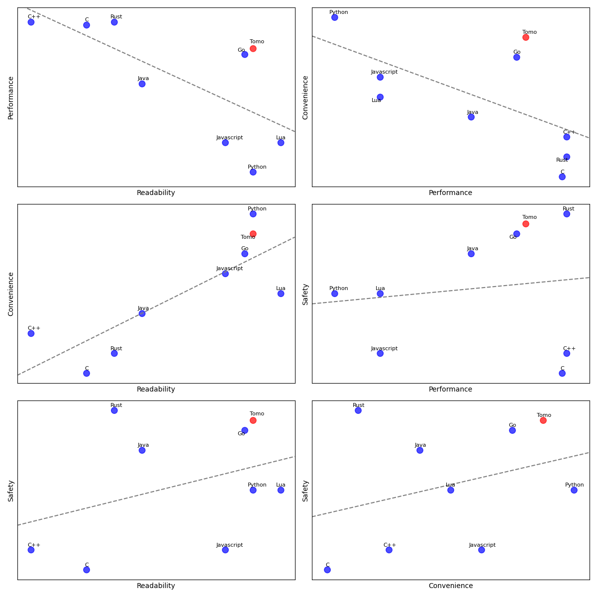

# Whirlwind Overview

Tomo is:

- Statically typed
- Imperative (mostly)
- Cross-compiled to C
- Garbage collected

```tomo
func sing_bottles(num_bottles:Int)
    for n in num_bottles.to(1)
        if n == 1
            say("One bottle of beer on the wall")
        else
            say("$n bottles of beer on the wall")

    say("No more bottles of beer on the wall!")

func main(n=99)
    sing_bottles(n)
```

---

# Backstory

- Not my first language ([nomsu.org](nomsu.org))
- Making languages is fun!
- Had a lot of free time in 2020–2022 for some reason
- Went through a lot of complete rewrites and redesigns

Tomo grew out of my desire for a language that has the best
traits of the languages I like:

- Fast and simple (low-level like C)
- Ergonomic and readable (like Python)
- Type safety without an elaborate type system (like Go)

I don't think there is such a thing as a perfect language,
but I think there's room for a new balance of those values.

---

# Completely Made Up Graphs



---

# Summing It Up

Basically, Tomo is in the same ballpark as Go or C#—it's fast and compiled and
has type safety and automatic memory management, but I think there are a lot of
improvements over Go and C#:

- Safer
- More ergonomic
- Faster compile times
- More consistent semantics
- Excellent Unicode support
- Some neat built-in features

---

# Cross Compilation to C

When you run `tomo myprogram.tm`, the compiler translates your Tomo code into
efficient C code that uses the Tomo standard library.

Then, it invokes a C compiler (tested to work with GCC, Clang, and TinyCC) to
build an executable and then runs it.

This code:

```tomo
func main()
    say("Hello world")
```

Gets compiled into this C code:

```c
__attribute__ ((visibility ("default")))
void _$hello$main() {
    (void)say(Text("Hello world"), yes);
}
```

Then, there's a bit of wrapper code to parse command line arguments (more on
that later) and your main function gets called.

---

# Type Inference

```tomo
x := 123
y := "Hello" 
z := (x < 10)
```

You can make types explicit, but almost never necessary:

```tomo
x : Int = 123
y : Text = "Hello"
z : Bool = (x < 10)
```

However, functions do require explicit types:

```tomo
func add(x,y:Int -> Int)
    return x + y
```

(A function that takes two integers and returns an integer)

---

# Primitive Types

- `Bool` boolean (`yes` or `no`)
- `Int` default integer type (overflows into bignum)
- `Num` floating point number (64-bit)
- `Text` AKA "string" in other languages

Some more niche ones:

- `Int64`, `Int32`, `Int16`, `Int8`
- `Num32`
- `Byte`
- `CString` (C-style NUL-terminated char array)

---

# Integers

Tomo's default integer type is `Int`, which _automatically
overflows into a bigint_.

```tomo
i := 1
repeat
    say("i = $i")
    i *= 2
```

This means that integer overflow can impact _performance_,
not _correctness_.

For small integers (smaller than about 500 million), `Int`
values don't use heap memory and operations are extremely
fast, with only a single conditional branch to check for
overflow.

[What About the Integer Numbers?](https://www.microsoft.com/en-us/research/wp-content/uploads/2022/07/int.pdf)
_Fast Arithmetic with Tagged Integers – A Plea for Hardware Support_

You can opt into fixed-width integers like `Int64` if you
need the performance, but the default is _correct_ and very
fast for most cases.

---

# Text

Tomo's built-in `Text` datatype solves some of the problems that other
languages have with strings. I chose to call it `Text` instead of `String` to
reflect the fact that these aren't your grandparents' "array of NUL-terminated
ASCII bytes" (also, "text" is shorter and more vernacular than "string")

Tomo Texts:

- *Normalized* unicode text
- Length-prefixed, not NUL-terminated (so length is constant-time)
- Uses a Rope datastructure for efficient concatenation and slicing
- Grapheme clusters are a *language construct,* not an afterthought
- Fast random access

```tomo
>> "🤦🏼‍♂️".length
= 1
```

[Note on string length](https://hsivonen.fi/string-length/)

---

# Lists

```tomo
nums := [10, 20, 30]
```

## 1-Indexed

```tomo
>> nums[2]
= 20
```

---

# Tables

Hash tables for O(1) lookups.

```tomo
scores := {"Alice"=10, "Bob"=5}
>> scores["Alice"]!
= 10
```

_Tables work on all types!_

---

# Sets

Like hash tables, but without values, only keys:

```tomo
nums := |1, 2, 3|
>> nums.overlap(|2, 3, 4|)
= |2, 3|
```

---

# Table Extra Features

Tables also have two extra tricks:

## Fallback Tables

```tomo
table1 := {"Alice"=10}
table2 := {"Bob"=5; fallback=table1}
>> table2["Alice"]!
= 10
```

## Default Values

```tomo
scores := {"Alice"=10; default=0}
>> scores["Carol"]
= 0
```

---

# Side Note: Empty Collections

Sadly, type inference can't read your mind when you create
an empty list, table, or set. So, you need to give it an
explicit type when declaring a variable:

```tomo
no_nums : [Int] = []
```

However, explicit types are not needed when reassigning a
variable, passing an argument, or giving a return value:

```tomo
func do_thing(nums:[Int] -> [Int])
    if nums.length > 10
        # No explicit type needed:
        return []
    return nums

# No explicit type needed:
do_thing([])
```

---

# Comprehensions

For convenience, Lists, Tables, and Sets have comprehensions
similar to Python's:

```tomo
primes := [i for i in 100 if i.is_prime()]
scores := {name=random.int(1,10) for name in names}
words := |w.lower() for w in text.split(" ")|
```

Comprehensions can also be mixed and matched with explicit
values and other comprehensions:

```tomo
primes := [2, i for i in (3).to(99, step=2) if i.is_prime()]

both_things := [x for x in xs, y for y in ys]
```

---

# Optional Types

In Tomo, any type can be optional, which means it either has
a value or is `none`.

```tomo
nickname : Text? = none
nickname = "Bubsy"
```

**Example:** parsing an integer:

```tomo
>> Int.parse("123")
= 123?

>> Int.parse("asdf")
= none
```

The type system enforces that optional values can't be used
where non-optional values are required:

```tomo
func add(x:Int, y:Int -> Int)
    return x + y

parsed := Int.parse(some_text)
# Type error:
>> add(parsed, 1)
```

---

# Using Optionals

The postfix `?` operator converts a non-optional value into
an optional value.

```tomo
>> nickname
= "Bubsy"?
```

The postfix `!` operator converts an optional value into a
non-optional value or errors if it was `none`

```tomo
>> nickname!
= "Bubsy"
```

You can also use `or` to give a fallback:

```tomo
nickname = none
>> nickname or "nah"
= "nah"
```

---

# Tables and Optional Values

**Note:** when accessing a key in a table, the returned
value is _optional_ because the key might not be in the
table:

```tomo
scores := {"Alice"=10}
>> scores["Alice"]
= 10?

>> scores["Xander"]
= none

>> scores["Xander"] or 0
= 0
```

---

# Structs

Structs let you define things that hold multiple members
with different types.

```tomo
struct LogEntry(username:Text, action:Text, when:Time = Time.now())
    func happened_after(e:LogEntry, time:Time -> Bool)
        return e.time > time

entry := LogEntry("Bruce", "gave presentation")
sleep(1)
>> entry.happened_after(Time.now())
= no
```

Structs can also have methods that let you define
functionality commonly associated with that struct.

You can also define namespaced functions or constants.

---

# Tagged Enumerations

```tomo
enum FooResult(Failure(reason:Text), Success(result:Int))
```

---

# Pattern Matching

```tomo
when run_program() is Failure(reason)
    say("Failed: $reason")
is Success(x)
    say("Success: $x")
```

- Exhaustiveness checking
- Uses a `switch` statement for fast performance on enums
- For other types, simple `if .. else if` equality checks

---

# Smart Inference

No `FooResult.` prefix in most cases:

```tomo
func run_program(-> FooResult)
    if blah
        return Failure("blah")
    else
        return Success(6)
```

---

# Paths

File paths are a native type with built-in literal syntax:

```tomo
config_file := (~/.config/myconfig.txt)

for line in config_file.by_line()!
    ...

config_file.append("New text\n")
```
---

# Pointers

Two types of pointers in Tomo:
- Pointers to heap-allocated memory (`@`)
- Pointers to stack-allocated memory (`&`)

Allocation uses a prefix operator:

```tomo
heap_nums := @[10, 20, 30]
stack_nums := &[10, 20, 30]
```

---

# Equality

In Tomo, a pointer is equal to another pointer **only** if
they point to the same memory.

```tomo
pointer1 := @[10, 20]
pointer2 := @[10, 20]

>> pointer1 == pointer2
= no
```

For things that are not pointers (e.g. Lists or Tables),
equality means _structural_ equality (i.e. they have the
same contents):

```tomo
list1 := [10, 20]
list2 := [10, 20]
```

---

# Mutability

In Tomo, values such as integers, lists, tables, etc. are
considered **immutable**. You can reassign variables, but
not change the contents:

```tomo
nums := [10, 20]
# Not allowed:
# nums.append(30)

# Allowed:
nums = [99, 100]
```

In order to mutate data, you need to use pointers:

```tomo
nums := @[10, 20]
nums.append(30)
>> nums
= @[10, 20, 30]
```

---

# Mutability Continued

In order to do structural comparisons between pointers
(compare their contents), you can use `[]` to access the
immutable value stored at the pointer's location:

```tomo
nums := @[10, 20]
other := @[10, 20]

# Are these the same pointer?
>> nums == other
= no

# Do these have the same contents?
>> nums[] == other[]
= yes
```

---

# Copy on Write

Immutable values in Tomo use copy-on-write behavior, so it's
efficient to have multiple variables referring to the same
data or even slices of the same data:

```tomo
lotta_nums := @[i*10 for i in 1000000]

# Not copying
same_nums := lotta_nums[]

# Not copying:
first_half := lotta_nums.to(lotta_nums.length/2)
```

---

# Control Flow

Basic control flow you'd expect:

```tomo
for thing in things
    do_thing(thing)

# Also:
for index, value in list
    pass
for key, value in table
    pass

if x < 10
    say("x is small")
else if x < 100
    say("x is medium")
else
    say("x is big")

repeat
    do_thing()

while condition != 0
    other_thing()
```

Yes, we also have named `break`/`continue` (`break x`,
`continue repeat` etc)

---

# Functions

Functions have explicit type information:

```tomo
def filled_int_array(count:Int, value=0 -> [Int])
    return [value for _ in count]
```

Default arguments and keyword arguments are supported:

```tomo
>> filled_int_array(3)
= [0, 0, 0]
>> filled_int_array(value=99, count=3)
= [99, 99, 99]
```

---

# First-class Functions

Functions are first-class values, so they can be passed to
other functions.

```tomo
func textify(x:Int -> Text)
    return "Cool: $x"

func apply(fn:func(x:Int -> Text), n:Int -> Text)
    return fn(n)
```

---

# Lambdas

Lambdas (anonymous functions) are also supported:

```tomo
n := 1
adder := func(x:Int) x + n
>> adder(5)
= 6
```

Return types can be inferred for lambdas, so only argument
types need to be specified explicitly.

Lambdas can capture values from the surrounding context,
although the captured values are frozen in time and the
lambda can't be used to reassign local variables or get new
values from those variables.

If I do `n = 2`, `adder` will still be using the old value
of `n`.

Lambdas can also span multiple lines, only the last
expression is used as a return value:

```tomo
fn := func(x:Int)
    say("You're using $x")
    x + 1
```

---

# Function Inlining

Add the `inline` modifier to functions to get function
inlining:

```tomo
def add(x,y:Int -> Int; inline)
    return x + y
```

Inlined functions can still be used as first-class values,
though the inlining obviously won't work if you pass it
around as a value.

---

# Function Caching

Any function can be sped up using `cached` or
`cache_size=...` to add a hash-table-based cache to the
function so it remembers previous calls:

```tomo
func fibonacci(n:Int; cache_size=10)
    return 1 if n <= 1
    return fibonacci(n-1) + fibonacci(n-2)
```

Since lists, tables, and sets are _immutable_, caching is
safe to do with functions that operate on anything that
doesn't use pointers.

For functions that _do_ use pointers, it's still okay, you
should just make sure the function's return value doesn't
depend on the pointers' contents if the contents might
change.

---

# Command Line Argument Parsing

Running a program invokes the `main()` function. But the
main function isn't limited to just taking a list of strings
that were passed in on the command line. Instead, it can
have a complex signature whose arguments will be parsed
automatically:

```tomo
func main(files:[Path], param=0, verbose=no)
    for file in files
        if verbose
            say("Doing thing with file $file")
            do_thing(file, param)
```

```bash
$ tomo -e myprogram.tm
$ ./myprogram --verbose file1.txt file2.txt --param=99
```

---

# Use

Tomo has a keyword called `use` that lets you use code from
other files or installed modules:

```tomo
# File 1
func do_thing()
    say("Did it!")
```

```tomo
# File 2
use ./file1.tm

func main()
    do_thing()
```

```bash
$ tomo file2.tm
Did it!
```

---

# Compilation Note

The compilation model has some nice features:

1. Each file is compiled _independently_
2. Files are recompiled as needed when their contents or
   their dependencies' contents change
3. Files are compiled _in parallel_

This means that compilation is _very fast_ compared to some
other languages.

There is also _no build configuration file!_
If you run a file, it compiles and runs the file and its
dependencies as needed. **The code itself defines what needs
to be compiled.**

---

# Libraries

You can build your own libraries that are compiled as shared
library files and installed on your computer. When you use
an installed library, the compiler will dynamically link
against it, which means it will not add to your compile
times.

To build and install a library, put your files in a
directory with the library's name and run `tomo -IL mylibrary`

To use an installed library:

```tomo
use mylibrary
```

Note: local files have the syntax `use ./myfile.tm` (full
relative file path), whereas installed libraries just use
the library's name: `use libname`

---

# Data Serialization

One of the most error-prone and tedious tasks in programming
is data serialization and deserialization. It can be hard to
do a good job of safely converting data into a format that
can be sent over a wire or saved to a disk and then
reconstituted later.

Tomo, however, has built-in data serialization and
deserialization!

```tomo
struct MyThing(x:Int, y:Text)

thing := MyThing(12345, "Some text")

(./thing.dat).write_bytes(thing.serialized())

roundtrip := deserialize((./thing.dat).read_bytes()! -> MyThing)
>> roundtrip == thing
= yes
```

Serialization works for (almost) all built-in types,
including pointers!

For datastructures like trees and cyclic graphs,
deserialization creates a new structure with the same
relationships as the original (though inhabiting new
memory).

---

# What Is a Secure Programming Language?

[What Is a Secure Programming Language?](https://www.youtube.com/watch?v=dhoP-dyIr54)
is talk given by Cristina Cifuentes
([paper](https://drops.dagstuhl.de/storage/00lipics/lipics-vol136-snapl2019/LIPIcs.SNAPL.2019.3/LIPIcs.SNAPL.2019.3.pdf))

> We contend that all of today’s mainstream programming
  languages are insecure, including even the most recent
  ones that come with claims that they are designed to be
  “secure”. [...] We propose a simple data-driven definition
  for a secure programming language: that it provides
  first-class language support to address the causes for the
  most common, significant vulnerabilities found in
  real-world software.

> In our analysis of the NVD data, interestingly, we
  discovered that three of the top four most common
  vulnerabilities are actually issues that can be considered
  to be in the realm of programming language design.
  Moreover, when combined, these three categories of
  vulnerabilities represent 53% of all labelled exploited
  vulnerabilities listed in the NVD for that period. [...]
  vulnerabilities they represent are as follows: 5,899
  buffer errors; 5,851 injection errors; 3,106 information
  leak errors.

Tomo addresses all three issues.

---

# Buffer Errors

**Fix 1:** Garbage collection **solves** many memory bugs
like use-after-free and makes it easy for functions to
allocate and return memory instead of requiring the use of
caller-provided buffers.

**Fix 2:** Array bounds checking, make it impossible to read
past the end of an array or list by checking at runtime.

**Fix 3:** Stack memory is not allowed to be stored in
heap-allocated memory or other stack-allocated memory. A
pointer to stack memory **cannot** outlive the call frame.

**Fix 4:** Length-prefixed text instead of NUL-terminated
strings. Don't let text contents tell you how long it is,
store that information out-of-band.

**Generally:** use good API design to avoid intrinsically
insecure APIs in the standard library (e.g. `scanf()`)

---

# Injection Errors

Injection occurs when one type of text (e.g. an
attacker-controlled username) is inserted into a different
context where it is executed as code (e.g. pasted into an
HTML page without escaping).

**The fix:** have the type system distinguish between
different kinds of text and **automatically escape text**
when converting between different contexts. Also, emit type
errors when attempting to concatenate different types of
text.

```tomo
lang HTML
    convert(text:Text -> HTML)
        return HTML.from_text(text.translate({
            "<"="&lt;", ">"="&gt;",
            '"'="&quot", "'"="&#39;",
            "&"="&amp;",
        }))
```

```tomo
username := "<script>alert('pwned!')</script>"

element := $HTML"
    <span>$username</span>
"
>> element
= '<span>&lt;script&gt;alert(&#39;pwned!&#39;)&lt;/script&gt;</span>'
```

---

# Information Leak Errors:
Secret structs:

```tomo
struct Password(text:Text; secret)
    func hash(p:Password -> PasswordHash)
        ...

password := Password("sw0rdf1sh")
>> "Your password is $password"
= "Your password is Password(...)"

if password.hash() == database.get_password_hash(username)
    do_login(username)
else
    # Oops, could have been a leak:
    log("Failed login: $username $password")
```

By default, every struct can be printed, showing its
contents. However, _secret_ structs only show their contents
as `(...)`. Accidentally logging a datastructure that
contains secret information _won't_ print anything secret
into the logs!

_This is not foolproof_, because the underlying information
is still accessible. But it means that it's much _harder_ to
make a simple mistake that leaks sensitive information.

---

# C Interoperability

Since Tomo cross-compiles to C, it's very easy for Tomo to
interface with existing C libraries and codebases. This
means that Tomo can take advantage of the large pre-existing
C ecosystem.

```tomo
# Use C headers and files directly:
use ./myheader.h
use ./mycfile.c

# Use shared libraries:
use <curl/curl.h>
use -lcurl

# Let tomo know about imported types:
extern atoi : func(str:CString -> Int32)

func main()
    x := Int32(5)
    # Inline C code:
    C_code {
        printf("%d\n", @x);
    }
    # Inline C expressions:
    y := C_code:Int32(abs(-5))
      
```

---

# Non-Feature 1: Inheritance

```tomo
# NOT VALID CODE:
struct Foo(x:Int) extends Baz
```

Object-oriented programming and inheritance _can_ be useful
for some applications, however it comes with a lot of
downsides.

- You need to do dynamic dispatching, which means storing
extra information alongside objects.
- Because of dynamic dispatching, the optimizer typically
can't inline method calls.
- Inheritance hierarchies add complexity to the codebase.

Tomo is a simple language with simple types.

Method calls and namespaces are useful, but inheritance adds
a lot of complexity.

If you need to mix and match reusable components, consider
composition over inheritance.

---

# Non-Feature 2: Generics

```tomo
# NOT VALID CODE:
struct Tree<T>(val:T, left,right:@Tree?)

# NOT VALID CODE:
func apply(x:T1, fn:func(x:T1 -> T2) -> T2)
    return fn(x)
```

Generics allow you to have write-once-compile-many-times
code. Unfortunately, this means that compilation times
skyrocket in code that uses a lot of generic datastructures
and generic functions.

You can no longer compile a single file in isolation, but
instead its code must be recompiled for every unique
combination of types in every file that uses it.

Tomo's approach is to have _powerful built-in generic
containers_ that don't need to recompile for different
member types. Most cases can be handled with a list, set, or
table. Special cases can be one-off bespoke code specialized
for a single type.

Tomo's built-in container types do _not_ require
recompilation for each combination of member types, but
instead rely on compile-time information implicitly passed
to the methods that need it.

Golang users loudly complained about a lack of generics in
the language, but... I think this was mostly because Go's
built-in container types were missing _critical_
functionality, like shuffling a list! Instead of adding the
missing functionality to address common pain points, they
chose to make it easier for users to reinvent the wheel
themselves.

---

# Non-Feature 3: Macros

I love macros! But not every language needs them.

There are two types of language that benefit from macros:
- Highly dynamic languages that focus on metaprogramming
(e.g. Lisp)
- Boilerplate-heavy languages that want a way to reduce code
duplication (e.g. C)

Tomo isn't a highly dynamic language, and it aspires to be a
low-boilerplate language.

Also: `inline` functions steal a lot of the thunder from
macros. It's a way to replace a function call with a bunch
of inlined code, but it has the advantages of full
typechecking, readable compiler errors, and a consistent
syntax.

Maybe one day, Tomo will add macros, but not until I find
something too painful to implement without macros.

---

# Future Features?

- Exact rational numbers? (Nice for working with money)
- Fixed-point numbers?
- Matrices?
- Built-in debugger?
- Built-in profiler?
- Better support for trees?

---

# Project Ideas

Command line tools:

- Print a file tree
- Text-based game like hangman
- Text-wrapping tool (e.g. `examples/wrap`)
- Simple calculator

General applications:

- Make a website with `examples/http-server`
- Make a game with Raylib (e.g. `examples/game`)
- Make an SDL application
