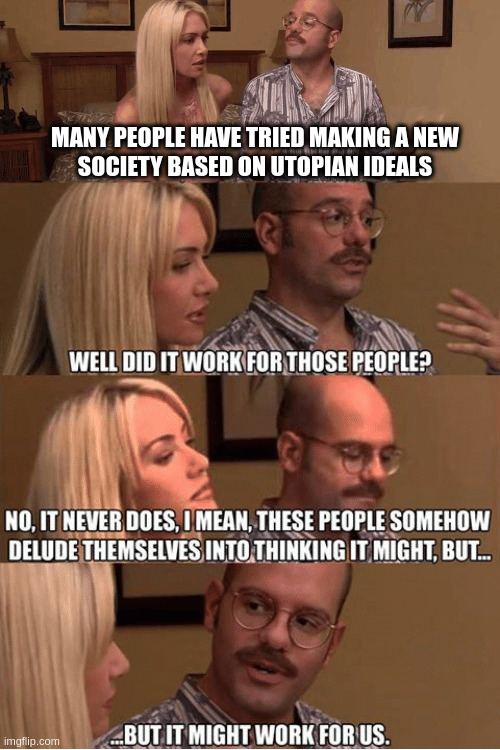

#!/bin/env slides

# Utopia

Another Bruce Hill Presentation

---

# Obligatory Etymology Slide

St. Thomas Moore wrote a political satire book in 1516:

> A truly golden little book, not less beneficial than
> enjoyable, about how things should be in a state
> and about the new island Utopia

What a mouthful!

The name is Greek:

**ou-** (not) **topos** (place) **ia** (place name)

Literally: **not a real place**

Kind of a play on words with "Eu" (good) "topia"
(the good place, shoutout to the TV show)

---

# Map of Utopia

---

# Precedent: Atlantis

Thomas More was probably inspired by Plato's 2001 animated
adventure film **"Atlantis: The Lost Empire"**

Atlantis is Plato's depiction of a fictional near-perfect
island society similar to his Republic

---

# Erewhon

1872 satire novel by Samuel Butler

**EREHWON** = **NOWHERE**

Written shortly after Darwin's Theory of Evolution

One of the first people to suggest that machines might
develop self-replicating abilities and intelligence through
natural selection ("Darwin among the machines")

In Dune, the "Butlerian Jihad" is named after Samuel Butler.

---

# Utopianism in America

In the mid to late 1800s, Utopianism was very popular.
Coming out of the Enlightenment with a lot of big ideas
about how to run a society rationally...
But also dealing with the Industrial Revolution and how
much it sucked for almost everyone.

[Paradise Now: The Story of American Utopianism](https://www.goodreads.com/book/show/25430297-paradise-now)

People in Europe saw the American West as an untouched (hah)
land of unlimited possibility, where a new social order
could be constructed from scratch.

---

# Utopian Movements

People wanted to grab some cheap, unsettled land and prove that
society **could** be run better:

- From **Manchester**: Mother Ann Lee and the **Shaking Quakers**
- From **Wales**: the industrialist Robert Owen and the **Owenites**
- From **France**: the psychadelic Charles Fourier and the **Fourierites**
- Also **France**: Étienne Cabet and the artist-co-op **Icarians**
- From **Vermont**: John Humphrey Noyes and the free-love **Oneidans**

Some good ideas, some ahead of their time, some very, very bad ideas.
Nearly all went bust, though some remnants remain.

Keywords: **Utopian Socialism**, **Communitarianism**

---

# The 20th Century

Gonna breeze past most of this century or we'll be
here all day and it's kind of a downer.

Some very big aspirations to make perfect societies in
Europe and Asia that **DID NOT GO WELL**

---

# Criticisms of Utopia

George Orwell wrote [Why Socialists Don't Believe in Fun (1943)](https://orwell.ru/library/articles/socialists/english/e_fun)

> This Christmas Day, thousands of men will be bleeding to death in
  the Russian snows, or drowning in icy waters, or blowing one another
  to pieces on swampy islands of the Pacific; homeless children will
  be scrabbling for food among the wreckage of German cities. To make
  that kind of thing impossible is a good objective. But to say in
  detail what a peaceful world would be like is a different matter.

> Nearly all creators of Utopia have resembled the man who has
  toothache, and therefore thinks happiness consists in not having
  toothache. [...] The wider course would be to say that there are
  certain lines along which humanity must move, the grand strategy is
  mapped out, but detailed prophecy is not our business. Whoever tries
  to imagine perfection simply reveals his own emptiness.

---

# The Big Rock Candy Mountains

A folk song about a hobo's utopia:

> … "In The Big Rock Candy Mountains
  All the cops have wooden legs
  And the bulldogs all have rubber teeth
  And the hens lay soft-boiled eggs

[Video](https://www.youtube.com/watch?v=NMAPOQedRxA)

---

# Karl Popper

[Utopia and Violence](https://mudrac.ffzg.hr/~dpolsek/Popper_utopija%20i%20nasilje%20eng.pdf)

> Since we cannot determine the ultimate ends of political
  actions scientifically, or by purely rational methods,
  differences of opinion concerning what the ideal state
  should be like cannot always be smoothed out by the method
  of argument. They will at least partly have the character
  of religious differences. And there can be no tolerance
  between these different Utopian religions.

- Utopianism is a matter of faith
- Political methods aimed at Utopia are beyond questioning
- Can't settle "my utopia vs your utopia" by evidence 
- All actions are justified to reach utopia
- "You can't make an omelette without breaking a few eggs"
- Inevitably leads to violence and totalitarianism

---

# The Sixties

---

# The Sixties
- Americans never learn lessons
- But what if **we** did it better?
- Hippy movement *loved* communes
- Let's go back to nature
- Grow our own food
- Communal child rearing (Historical note: *no!*)
- Nearly all went bust very rapidly

---

# Case Study: Twin Oaks

- Commune based on a BF Skinner (yes, the "Skinner Box" guy)
  utopian science fiction novel
- Founded in Virginia in 1967
- Shockingly [still exists!](https://www.twinoaks.org/)
- Spawned an offshoot community (Acorn Community Farm)

First-hand accounts from Kat Kinkade:

- [A Walden Two Experiment](https://www.goodreads.com/book/show/229346.A_Walden_Two_Experiment_The_First_Five_Years_of_Twin_Oaks_Community)
- [Is It Utopia Yet?](https://www.goodreads.com/en/book/show/1719211.Is_It_Utopia_Yet_) (no)

---

# Still Going at It

- [Cryptoland](https://www.youtube.com/watch?v=ZFoAF6lY6iI&pp=ygUKY3J5cHRvbGFuZA%3D%3D)
- [Seasteading](https://en.wikipedia.org/wiki/Seasteading)
- [Sealand](https://en.wikipedia.org/wiki/Principality_of_Sealand)
- [MS Satoshi](https://en.wikipedia.org/wiki/MS_Ambience#2020%E2%80%932021:_Satoshi)
- [Freedom Ship](https://en.wikipedia.org/wiki/Freedom_Ship)

Now it's a lot of libertarians in the ocean I guess?
**Bonus desert variants:** Burning Man, NEOM (the Line), [Dahir Insaat](https://www.youtube.com/watch?v=MWsRMUicIa8)

---

# Conclusion

Love the enthusiasm, but folks need to tone it down a bit.

What has software taught us about
"we should rewrite everything in a new language"?

We're just gonna re-encounter all the problems that the old
system had already encountered and fixed.

---

# Closing Quote

Karl Popper (1947):

> Work for the elimination of concrete evils rather than for the
  realization of abstract goods. Do not aim at establishing happiness
  by political means. Rather aim at the elimination of concrete
  miseries. Or, in more practical terms: fight for the elimination of
  poverty by direct means‐‐for example, by making sure that everybody
  has a minimum income. Or fight against epidemics and disease by
  erecting hospitals and schools of medicine. Fight illiteracy as you
  fight criminality. But do all this by direct means. Choose what you
  consider the most urgent evil of the society in which you live, and
  try patiently to convince people that we can get rid of it. But do
  not try to realize these aims indirectly by designing and working
  for a distant ideal of a society which is wholly good. However
  deeply you may feel indebted to its inspiring vision, do not think
  that you are obliged to work for its realization, or that it is your
  mission to open the eyes of others to its beauty. Do not allow your
  dreams of a beautiful world to lure you away from the claims of men
  who suffer here and now. Our fellow men have a claim to our help; no
  generation must be sacrificed for the sake of future generations,
  for the sake of an ideal of happiness that may never be realized. In
  brief, it is my thesis that human misery is the most urgent problem
  of a rational public policy and that happiness is not such a
  problem. The attainment of happiness should be left to our private
  endeavours.
